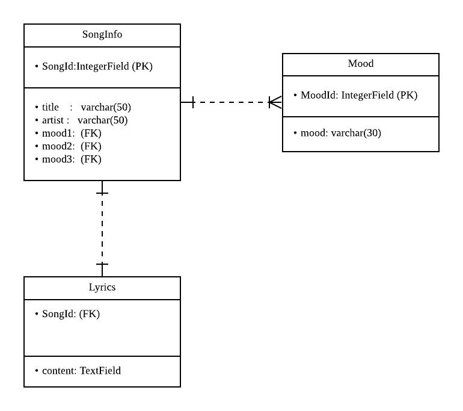

## 210614 개발 일지


#### Back-end 개발

* SuperUser & AdminPage 생성(채원)

  * 공식문서를 참고해 관리자 페이지를 생성했다.
  * https://docs.djangoproject.com/ko/3.2/intro/tutorial02/#creating-an-admin-user

* Database Model 설계 및 생성. Migration 완료(채원+수현)

  * Database Model ERM 설계
  

  * Django 모델링시 1:N 관계 표현은 onetomany가 아니라 ForeignKey로 참조하는 테이블명과 related_name

  * Django에서 모델링시 1:N 관계 표현은 Foreign키를 설정해주고 뒤에 참조하는 테이블명과  related_name, 빈칸 허용(blank=True)을 설정해준다.
    related_name을 설정해주는 것은 장고의 ORM기능을 활용하기 위함이다.

    (처음에는 manytomany 관계 표현처럼 'onetomany' 라는 것이 있을 것이라 생각했으나 전혀 아니었다..)

  * on_delete=models.CASCADE 옵션은 외래키를 포함하는 행도 함께 삭제하기 위함이다.

  ```python
  from django.db import models
  
  # Create your models here.
  class Mood(models.Model):
      moodId = models.IntegerField(primary_key=True)
      mood = models.CharField(max_length=30)
  
  class SongInfo(models.Model):
      mood1 = models.ForeignKey(Mood, related_name='mood1', blank=True, on_delete=models.CASCADE)
      mood2 = models.ForeignKey(Mood, related_name='mood2', blank=True, on_delete=models.CASCADE)
      mood3 = models.ForeignKey(Mood, related_name='mood3', blank=True, on_delete=models.CASCADE)
  ```

* Server URL 설계 및 Class 생성(수현)

  * Front-End가 들어올 코드를 생성
     * musiclist 가 songId를 파라미터로 데이터 요청이들어오면 아래 url로 들어가 데이터를 가져온다.
    ```python
    urlpatterns = [
        path('musiclist/', include('lyrics.urls')),
        path('admin/', admin.site.urls),  
    ]
    ```
  * 실제 요청을 처리하는 부분 
    ```python
    class MusicList(View):
      # GET Data
      def get(self, request):
          if request.GET('moodid', False):
              print(request.GET['moodid'])
          return JsonResponse({"1":"1"})

      # post Data
      def musiclist(self, request):
          return HttpResponse("OK")
    ```


----

#### Front-end 개발

MusicDetail Page UI 작성(현우)

- 헤더 배치 변경
- 기존 SongItem 컴포넌트에서 앨범 이미지를 키우고 가사를 아래로 배치
- 기분 태그 추가